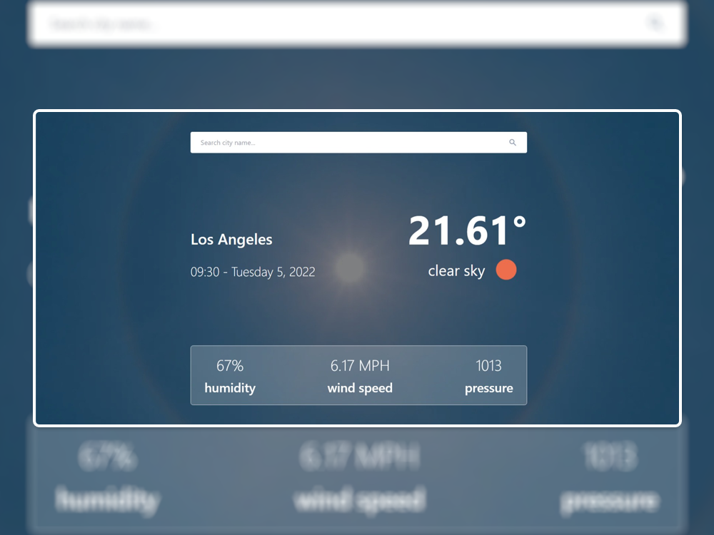
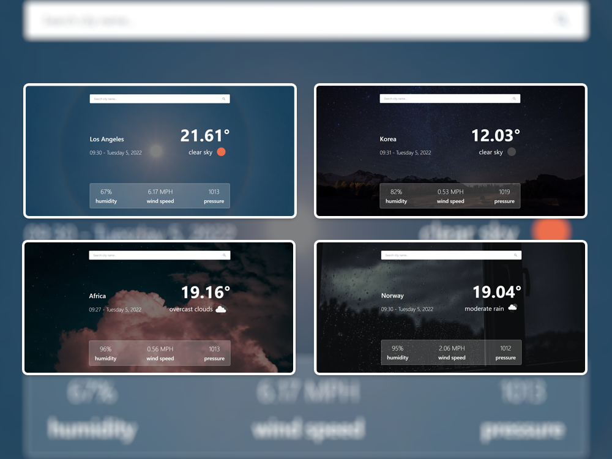
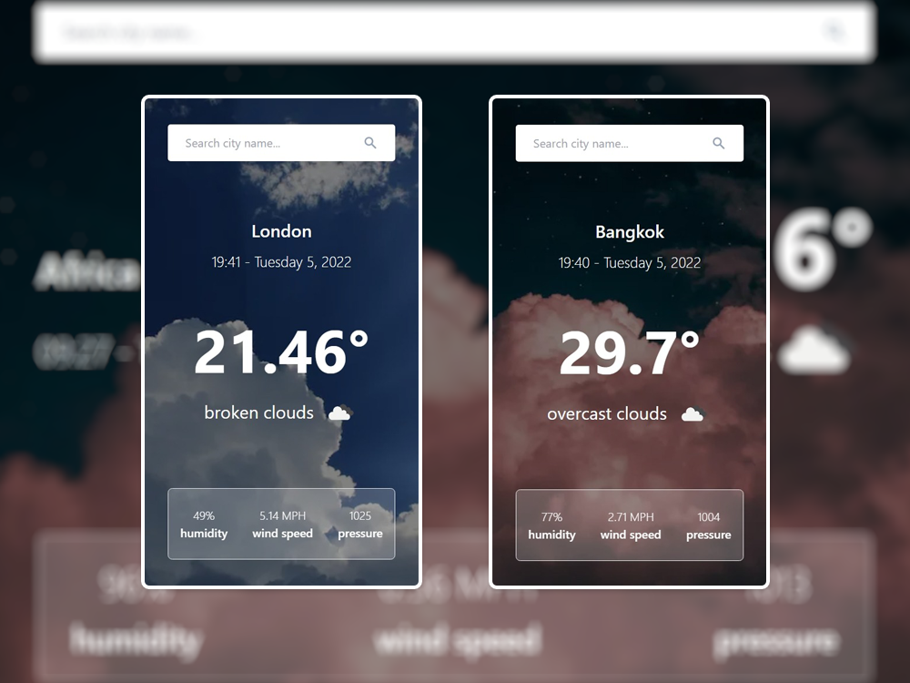

# Weather App

A weather app create with Next.js and OpenWeatherMap API

## [Link To App Here](https://weather-app-three-theta.vercel.app/)

## Stack
- [Next.js](https://nextjs.org/) - A React framework with hybrid static & server rendering, and route pre-fetching, etc.
- [OpenWeatherMap](https://openweathermap.org/) - An API for calling weather data. 
- [Framer Motion](https://www.framer.com/motion/) - An animation library for React.
- [Tailwind CSS](https://tailwindcss.com/) - A utility-first CSS framework for rapidly building custom user interfaces.

## Features
`Search filter` - Filter location names from the input users were typing and suggested below the search box.

`Smooth animation` - Smooth fade-in animation every time component get loaded.

`Dynamic Background` - Background changes relate to the weather.

## Design

